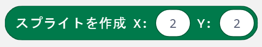

# 準備中
## プログラムダウンロード

| 章  | ゲーム名             | プログラム                               |
| --- | -------------------- | ---------------------------------------- |
| 3章 | ミニアクションゲーム | [基本編](https://) / [応用編](https://)  |
| 4章 | キャッチゲーム       | [基本編](https://) / [応用編](https://)  |
| 5章 | 逃走ゲーム           | [基本編](https://) / [応用編](https://)  |
| 6章 | リズムゲーム         | [基本編](https://) / [応用編](https://)  |
| 7章 | シューティングゲーム | [基本編](https://) /  [応用編](https://) |
| 8章 | 無線でパワーアップ   | [基本編](https://)                       |
| 9章 | ゲーム機を作ろう     | [基本編](https://) / [応用編](https://)  |

## ブロックリファレンス
| ブロック                                | 機能                           | パラメータ                                                                            | 注意                                                                                                                 |
| --------------------------------------- | ------------------------------ | ------------------------------------------------------------------------------------- | -------------------------------------------------------------------------------------------------------------------- |
|  | 新しいスプライトを作成します。 | **X:** スプライトの横向きの位置（X座標） **Y:** スプライトの縦向きの位置（Y座標） | 作成されたスプライトは右を向いています。0より小さい数字を入れると0になります。4より大きい数字を入れると4になります。 |
