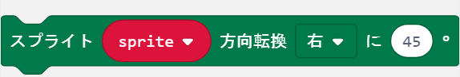

<link href="css/microbit.css" rel="stylesheet">

# 準備中
## プログラムダウンロード

| 章  | ゲーム名             | プログラム                               |
| --- | -------------------- | ---------------------------------------- |
| 3章 | ミニアクションゲーム | [基本編](https://) / [応用編](https://)  |
| 4章 | キャッチゲーム       | [基本編](https://) / [応用編](https://)  |
| 5章 | 逃走ゲーム           | [基本編](https://) / [応用編](https://)  |
| 6章 | リズムゲーム         | [基本編](https://) / [応用編](https://)  |
| 7章 | シューティングゲーム | [基本編](https://) /  [応用編](https://) |
| 8章 | 無線でパワーアップ   | [基本編](https://)                       |
| 9章 | ゲーム機を作ろう     | [基本編](https://) / [応用編](https://)  |

## ブロックリファレンス

<table cellspacing="0">
    <tbody>
        <tr>
            <th>ブロック</th>
            <td></td>
        </tr>
        <tr>
            <th>機能</th>
            <td>新しいスプライトを作成します。</td>
        </tr>
        <tr>
            <th>パラメータ</th>
            <td>
                <ul>
                    <li>X: スプライトの横向きの位置（X座標）</li>
                    <li>Y: スプライトの縦向きの位置（Y座標）</li>
                </ul>
                
0と4は画面端を表し、2が中心です。

            </td>
        </tr>
        <tr>
            <th>注意</th>
            <td>
                <ul>
                    <li>作成されたスプライトは右を向いています。</li>
                    <li>0より小さい数字を入れると0になります。</li>
                    <li>4より大きい数字を入れると4になります。</li>
                </ul>
            </td>
        </tr>

<!--
<tr>
    <td></td>
    <td>スプライトを削除します。</td>
    <td>削除するスプライトの名前</td>
    <td>削除したスプライトは画面から消えて、他のスプライトと衝突しなくなります。</td>
</tr>
<tr>
    <td></td>
    <td>スプライトを現在向いている方向に移動します。</td>
    <td>移動する距離</td>
    <td>画面端を超えて移動することはありません。</td>
</tr>
<tr>
    <td></td>
    <td>スプライトを回転させて、向きを変えます</td>
    <td>
        <ul>
            <li>向き: 右 または 左</li>
            <li>角度: スプライトを回転させる角度（45°ごと）</li>
        </ul>
    </td>
    <td>45°ごとではない数字を入れると、直前の45°ごとの数字に変換されます。
        <ul>
            <li>例）80° → 45°</li>
            <li>例）179° → 135°</li>
        </ul>
    </td>
</tr>
<tr>
    <td></td>
    <td>スプライトが画面端にあり、かつ、画面端の方向を向いていれば、反射させます。</td>
    <td>反射させるスプライトの名前</td>
    <td></td>
</tr>
<tr>
    <td></td>
    <td>スプライトの様々な情報を取得します。</td>
    <td>
        <ul>
            <li>X: スプライトのX座標（0-4）</li>
            <li>Y: スプライトのY座標（0-4）</li>
            <li>向き: スプライトの向き（角度）</li>
            <li>明るさ: スプライトの明るさ（0-255）</li>
            <li>点滅: スプライトの点滅速度（0-10000）</li>
        </ul>
    </td>
    <td></td>
</tr>
-->

    </tbody>
</table>

