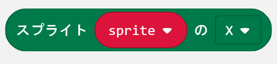
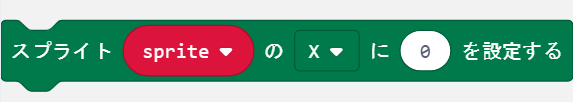
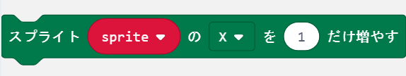
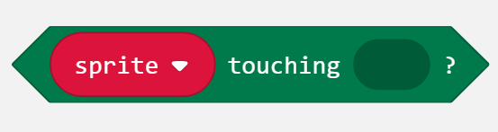
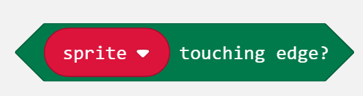

## プログラムダウンロード

| 章  | ゲーム名             | プログラム                               |
| --- | -------------------- | ---------------------------------------- |
| 3章 | ミニアクションゲーム | [基本編](https://) / [応用編](https://)  |
| 4章 | キャッチゲーム       | [基本編](https://) / [応用編](https://)  |
| 5章 | 逃走ゲーム           | [基本編](https://) / [応用編](https://)  |
| 6章 | リズムゲーム         | [基本編](https://) / [応用編](https://)  |
| 7章 | シューティングゲーム | [基本編](https://) /  [応用編](https://) |
| 8章 | 無線でパワーアップ   | [基本編](https://)                       |
| 9章 | ゲーム機を作ろう     | [基本編](https://) / [応用編](https://)  |

## ブロックリファレンス

<table id="create" class="block">
    <tr>
        <td colspan="2"></td>
    </tr>
    <tr>
        <th>機能</th>
        <td>新しいスプライトを作成します。</td>
    </tr>
    <tr>
        <th>パラメータ</th>
        <td>
            <ul>
                <li>X: スプライトの横向きの位置（X座標）</li>
                <li>Y: スプライトの縦向きの位置（Y座標）</li>
            </ul>
            
0と4は画面端を表し、2が中心です。

        </td>
    </tr>
    <tr>
        <th>注意</th>
        <td>
            <ul>
                <li>作成されたスプライトは右を向いています。</li>
                <li>0より小さい数字を入れると0、4より大きい数字を入れると4になります。</li>
            </ul>
        </td>
    </tr>
</table>

<table id="delete" class="block">
    <tr>
        <td colspan="2"></td>
    </tr>
    <tr>
        <th>機能</th>
        <td>スプライトを削除します。</td>
    </tr>
    <tr>
        <th>パラメータ</th>
        <td>削除するスプライトの名前</td>
    </tr>
    <tr>
        <th>注意</th>
        <td>削除したスプライトは画面から消えて、他のスプライトと衝突しなくなります。</td>
    </tr>
</table>

<table id="move" class="block">
    <tr>
        <td colspan="2"></td>
    </tr>
    <tr>
        <th>機能</th>
        <td>スプライトを現在向いている方向に移動します。</td>
    </tr>
    <tr>
        <th>パラメータ</th>
        <td>移動する距離</td>
    </tr>
    <tr>
        <th>注意</th>
        <td>画面端を超えて移動することはありません。</td>
    </tr>
</table>

<table id="turn" class="block">
    <tr>
        <td colspan="2"></td>
    </tr>
    <tr>
        <th>機能</th>
        <td>スプライトを回転させて、向きを変えます</td>
    </tr>
    <tr>
        <th>パラメータ</th>
        <td>
            <ul>
                <li>向き: 右 または 左</li>
                <li>角度: スプライトを回転させる角度（45°ごと）</li>
            </ul>
        </td>
    </tr>
    <tr>
        <th>注意</th>
        <td>45°ごとではない数字を入れると、直前の45°ごとの数字に変換されます。
            <ul>
                <li>例）80° → 45°</li>
                <li>例）179° → 135°</li>
            </ul>
        </td>
    </tr>
</table>

<table id="bounce" class="block">
    <tr>
        <td colspan="2"></td>
    </tr>
    <tr>
        <th>機能</th>
        <td>スプライトが画面端にあり、かつ、画面端の方向を向いていれば、反射させます。</td>
    </tr>
    <tr>
        <th>パラメータ</th>
        <td>特になし。</td>
    </tr>
    <tr>
        <th>注意</th>
        <td>反射するとスプライトの向きが180°変わります。</td>
    </tr>
</table>

<table id="get" class="block">
    <tr>
        <td colspan="2"></td>
        </tr>
    <tr>
        <th>機能</th>
        <td>スプライトの様々な情報を取得します。</td>
    </tr>
    <tr>
        <th>パラメータ</th>
        <td>
            <ul>
                <li>X: スプライトのX座標（0-4）</li>
                <li>Y: スプライトのY座標（0-4）</li>
                <li>向き: スプライトの向き（角度）</li>
                <li>明るさ: スプライトの明るさ（0-255）</li>
                <li>点滅: スプライトの点滅速度（0-10000）</li>
            </ul>
        </td>
    </tr>
    <tr>
        <th>注意</th>
        <td>特になし。</td>
    </tr>
</table>

<table id="set" class="block">
    <tr>
        <td colspan="2"></td>
        </tr>
    <tr>
        <th>機能</th>
        <td>スプライトの様々な情報を設定します。</td>
    </tr>
    <tr>
        <th>パラメータ</th>
        <td>
            <ul>
                <li>X: スプライトのX座標（0-4）</li>
                <li>Y: スプライトのY座標（0-4）</li>
                <li>向き: スプライトの向き（角度）</li>
                <li>明るさ: スプライトの明るさ（0-255）</li>
                <li>点滅: スプライトの点滅速度（0-10000）</li>
            </ul>
            <li>値: スプライトに設定する新しい数値</li>
        </td>
    </tr>
    <tr>
        <th>注意</th>
        <td>範囲外の値を設定した場合、値が自動的に切り詰められます。</td>
    </tr>
</table>

<table id="change" class="block">
    <tr>
        <td colspan="2"></td>
        </tr>
    <tr>
        <th>機能</th>
        <td>スプライトの様々な情報を変更します。</td>
    </tr>
    <tr>
        <th>パラメータ</th>
        <td>
            <ul>
                <li>X: スプライトのX座標（0-4）</li>
                <li>Y: スプライトのY座標（0-4）</li>
                <li>向き: スプライトの向き（角度）</li>
                <li>明るさ: スプライトの明るさ（0-255）</li>
                <li>点滅: スプライトの点滅速度（0-10000）</li>
            </ul>
            <li>値: 変更する数値</li>
        </td>
    </tr>
    <tr>
        <th>注意</th>
        <td>範囲外の値を設定した場合、値が自動的に切り詰められます。</td>
    </tr>
</table>

<table id="touching" class="block">
    <tr>
        <td colspan="2"></td>
    </tr>
    <tr>
        <th>機能</th>
        <td>スプライトが他のスプライトと同じ位置にあるかどうか調べます。</td>
    </tr>
    <tr>
        <th>パラメータ</th>
        <td>同じ位置にあるか調べる相手のスプライト</td>
    </tr>
    <tr>
        <th>戻り値</th>
        <td>
            <ul>
                <li>真: 2つのスプライトが同じ位置にある場合</li>
                <li>偽: 2つのスプライトが同じ位置にない場合</li>
            </ul>
        </td>
    </tr>
    <tr>
        <th>注意</th>
        <td>同じ位置にあるというのは、スプライトが存在していて、X・Y座標がいずれも等しいことです。</td>
    </tr>
</table>

<table id="touchingEdge" class="block">
    <tr>
        <td colspan="2"></td>
    </tr>
    <tr>
        <th>機能</th>
        <td>スプライトが画面端にあるかどうかを調べます。</td>
    </tr>
    <tr>
        <th>パラメータ</th>
        <td>特になし。</td>
    </tr>
    <tr>
        <th>戻り値</th>
        <td>
            <ul>
                <li>真: スプライトが画面端にある場合</li>
                <li>偽: スプライトが画面端にない場合</li>
            </ul>
        </td>
    </tr>
    <tr>
        <th>注意</th>
        <td>画面端というのは、X座標またはY座標が0か4のときです。</td>
    </tr>
</table>
